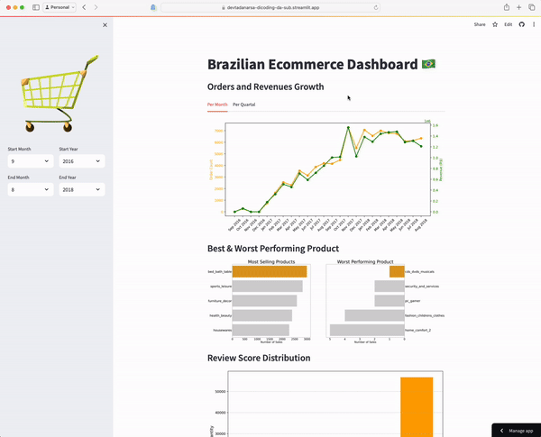

# E-Commerce Public Data Analysis
by Devta Danarsa

## Installation and Environment Setup
```
git init
git clone https://github.com/devtadanarsa/dicoding-da-submissions.git
cd dicoding-da-submissions
pip install -r requirements.txt
```

## Run Steamlit App
```
streamlit run dashboard/dashboard.py
```

## Demo

Or try it by yourself, just <a href="https://devtadanarsa-dicoding-da-sub.streamlit.app" target="_blank">click here!</a>